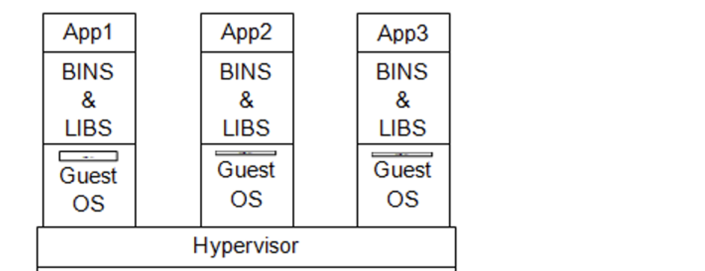
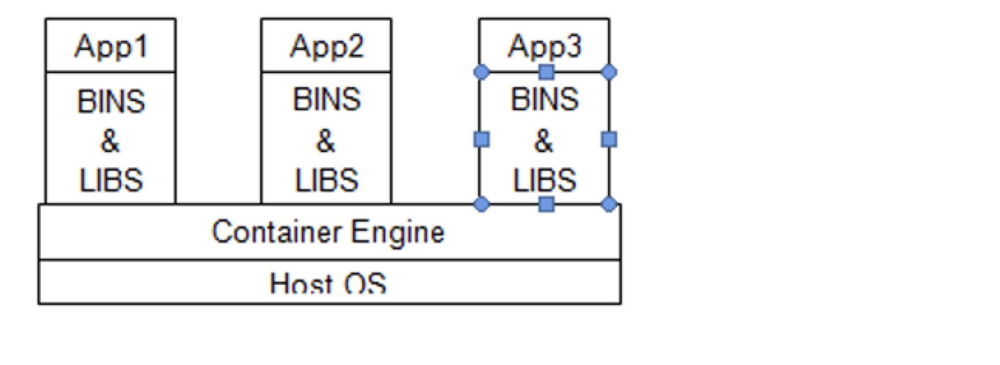
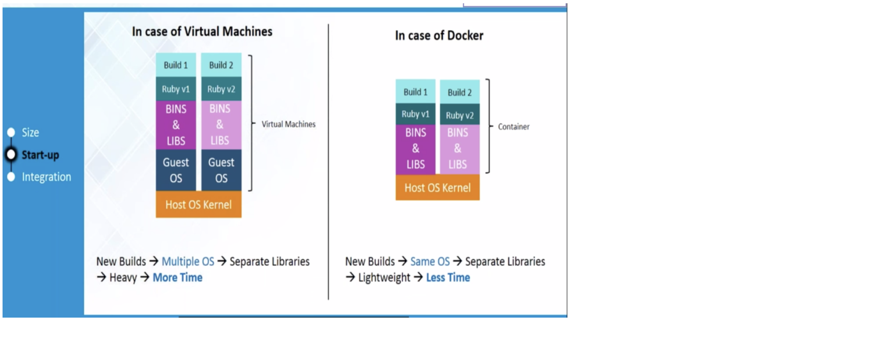

# 01_docker_introduction

##### Shift in The Technology-
- 90’s – Mainframe to PC
- 00’s – Baremetal to Virtualization
- 10’s – Datacentre to Cloud
- Now – Host to Containerization (Severless)

##### Difference b/w Virtualization and Containarization-
Virtualization-

Here Hypervisor could be Virtual Machine

Containerization-

###### What is Docker?
Docker is a containerization platform which packages your application and all its dependencies together in the form of containers so as to ensure that your application works seamlessly in any environment be it Development or Test or Production.

##### Virtualization v/s Containerization-
| Virtualization | Containerization |
| ------ | ------ |
|Multiple OS in same machine |Multiple OS in same machine|
|Multiple VMs lead to unstable performance (Because upon Host OS Guest OS is mounted and will have it’s own kernel so chunks up the system)|Containers on same OS kernel are lighter & smaller|
|Fixed Hard disk and RAM capacity associated during creation of VM’s|Not fixed. It just considers the Hard disk and memory required to run the application. Remaining could be used for other contain|
|Hypervisors are not as efficient as host OS|Containerization is good|
|Long boot-up process (Approx. 1 min)|Short boot-up process (1/20th of a second)|

##### Advantages of Docker-
- An application inside a container can run on any system that has Docker installed. So, there’s no need to build and configure app multiple times on different platforms
- Platform independent – if application running fine in one environment would work well in other environment as well – no need to worry about env properties etc.
- Container portability- we can ship containers from one server to another.
- Version Control- Docker is a light weight application so we can version control our images.
- Isolation – The application running in one container does not interfere with the application running in other container.
- Productivity – with all above features, the productivity increases as we do not have to worry much about build & configuring & deploying application, environment settings etc.

##### Building & Deployment-
- VM- Since an each VM container would have it’s own O.S over Host O.S – it consumes lot of time to boot VM’s as first Host OS has to be started followed by VM’s O.S. Suppose when you wanted to start the applications faster – VM’s is not the good idea.
- Docker - This is not the case with Docker as Docker containers would directly run on Host O.S. Consider you wanted to install two versions of Ruby – You will need two VM containers and takes lot of time to boot the VM’s. In the case of Docker as well, you will need two containers but they will be faster as they directly hosted on Host OS.

